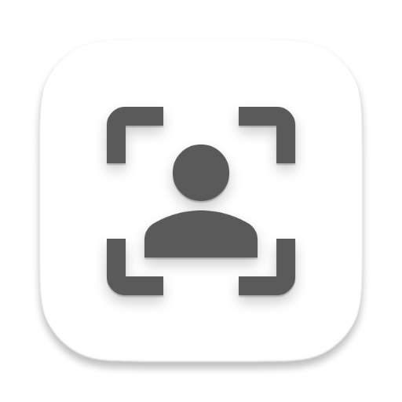

# Aware

<p align="center">
  
</p>

A macOS menu bar app that keeps your Mac awake by detecting your presence with the FaceTime camera.

## How It Works

- **Local & private** — No networking; nothing is sent anywhere. Frames are processed on-device and discarded immediately.
- **Hardware-accelerated** — Uses Vision on Apple Silicon; face detection runs on GPU/Apple Neural Engine, not CPU.
- **Smart presence detection** — Skips camera checks when you've used the keyboard or mouse in the last 30 seconds.
- **Menu bar only** — No Dock icon; runs quietly in the background.

## Quick Start

**Download:** [GitHub Releases](https://github.com/LPFchan/Aware/releases) — download `Aware.zip`, unzip, and drag `Aware.app` to Applications.

**Build from source:**
```bash
xcodebuild -scheme Aware -configuration Debug -derivedDataPath build build
open build/Build/Products/Debug/Aware.app
```
Or double-click **Launch Aware.command** to build and launch in one step.

Grant camera access when prompted, then click the person icon in the menu bar to enable.

**Create a release:** `git tag v1.0.0 && git push origin v1.0.0` — GitHub Actions builds and attaches `Aware.zip`.

## Requirements

- macOS 13+
- Camera access (requested on first launch)
